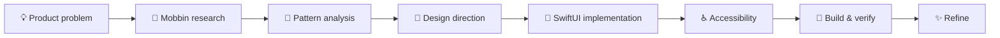

<div align="center">

# Mobbin × SwiftUI Skills

### Reference-driven product design for native iOS apps

Research real-world mobile interfaces with **Mobbin**, extract the design patterns that matter, and turn them into polished, accessible **SwiftUI**.

<br />

[](https://developer.apple.com/xcode/swiftui/)
[](https://chatgpt.com/skills)
[](https://mobbin.com/)
[](https://github.com/Patryk-Jastrzebski/mobbin-swiftui-skills/stargazers)
[](https://github.com/Patryk-Jastrzebski/mobbin-swiftui-skills/commits/main)

<br />

**Research → Understand → Adapt → Build → Verify**

A focused collection of agent skills for building iOS interfaces from real product references instead of generic AI assumptions.

[Explore the skills](#-skills) · [Quick start](#-quick-start) · [Example prompts](#-example-prompts)

</div>

---

## ✨ Why this exists

AI can generate SwiftUI quickly.

The harder part is generating SwiftUI that feels like a **real product**.

These skills introduce a reference-driven workflow:

```text
Real shipped products
        ↓
Mobbin research
        ↓
Pattern extraction
        ↓
Product-specific decisions
        ↓
Native SwiftUI
        ↓
Visual + UX verification
```

Instead of asking an agent to invent a random onboarding flow, paywall, form, settings screen, or dashboard from memory, you can first study how successful products solve the same problem.

Then use those findings as **evidence**, not as something to blindly clone.

---

## 🧠 The idea

| Generic AI UI                         | Mobbin × SwiftUI workflow                             |
| ------------------------------------- | ----------------------------------------------------- |
| Invents patterns from memory          | Studies real shipped interfaces                       |
| Often produces generic layouts        | Starts from proven product patterns                   |
| Focuses mainly on the happy path      | Considers loading, empty, error and validation states |
| Can overuse custom UI                 | Prefers native iOS behavior                           |
| Copies visual details without context | Extracts the reasoning behind patterns                |
| Stops when the code looks correct     | Encourages build and visual verification              |

The goal is not:

> “Make my app look exactly like Product X.”

The goal is:

> “Understand why good products solve this problem the way they do, then build an original native solution for my product.”

---

## 🧩 Skills

This repository currently contains two complementary skills.

### 🔎 `mobbin-design-research`

**Design research before implementation.**

[`mobbin-design-research`](./mobbin-design-research) helps an agent research real mobile interfaces using Mobbin and convert those references into actionable product and UI decisions.

Use it to research:

* onboarding flows
* authentication
* subscription paywalls
* checkout
* search
* filtering
* profile screens
* settings
* empty states
* dashboards
* forms
* content creation
* navigation patterns
* multi-step flows
* redesign opportunities

Instead of returning a collection of screenshots, the skill focuses on extracting useful patterns:

```text
Observed reference
      ↓
Repeated pattern
      ↓
Why the pattern works
      ↓
Trade-offs
      ↓
Adaptation for your product
```

A research result can define:

* information hierarchy
* screen purpose
* navigation model
* primary actions
* secondary actions
* forms and inputs
* validation behavior
* presentation style
* loading states
* empty states
* error states
* offline behavior
* persistence
* interaction patterns

#### Best for

```text
"Research this before we build it."
```

---

###  `swiftui-reference-design`

**Turn references and design decisions into native SwiftUI.**

[`swiftui-reference-design`](./swiftui-reference-design) helps an agent design, implement and refine iOS interfaces using references while respecting the architecture of the existing SwiftUI project.

It focuses on more than visual similarity.

The skill considers:

* native SwiftUI architecture
* navigation
* existing project structure
* reusable components
* semantic colors
* typography
* spacing
* safe areas
* Dynamic Type
* VoiceOver
* Reduce Motion
* hit targets
* keyboard behavior
* light and dark appearance
* loading states
* empty states
* error states
* success states
* state ownership
* simulator verification
* visual refinement

#### Native-first

Prefer platform behavior before reinventing it.

```text
NavigationStack
Sheets
ScrollView / List
SF Symbols
System typography
Native controls
Accessibility APIs
SwiftUI state management
```

Custom UI is introduced when it serves a real product or interaction requirement — not simply to make the implementation look more complex.

#### Best for

```text
"Now build this properly in SwiftUI."
```

---

## ⚡ The workflow

The two skills are designed to work together.



### 1. Define the problem

Start with the product problem rather than the desired visuals.

For example:

```text
I need a subscription paywall for an iOS productivity app.
```

### 2. Research

Use `mobbin-design-research`.

```text
Research how high-quality iOS productivity apps structure
subscription paywalls.

Compare several approaches to plan selection, trial messaging,
feature hierarchy, restore purchase and dismissal.
```

### 3. Extract the design direction

Turn references into decisions.

```text
References
   ↓
Patterns
   ↓
Trade-offs
   ↓
Recommended direction
```

### 4. Implement

Use `swiftui-reference-design`.

```text
Use the research direction to implement the paywall
inside my existing SwiftUI project.

Preserve the current architecture and design system.
```

### 5. Verify

Check the actual experience.

Not only:

```text
Does the Swift compile?
```

But also:

```text
Does it feel native?
Is hierarchy clear?
Does Dynamic Type work?
Does VoiceOver make sense?
What happens when data is missing?
What happens when loading fails?
Does the rendered screen match the intended design?
```

---

## 🚀 Quick start

### Clone the repository

```bash
git clone https://github.com/Patryk-Jastrzebski/mobbin-swiftui-skills.git
cd mobbin-swiftui-skills
```

The repository contains:

```text
mobbin-swiftui-skills/
│
├── mobbin-design-research/
│   └── SKILL.md
│
├── swiftui-reference-design/
│   └── SKILL.md
│
└── README.md
```

Each skill lives in its own directory and is driven by its `SKILL.md`.

---

## 🤖 Using with ChatGPT Skills

The skills are designed around the Agent Skills format.

Open:

**https://chatgpt.com/skills**

and add the skill you want to use from this repository according to your Skills setup.

You can use the skills individually:

```text
mobbin-design-research
```

or:

```text
swiftui-reference-design
```

For the strongest workflow, use both:

```text
mobbin-design-research
        ↓
swiftui-reference-design
```

---

## ⌨️ Using with Codex

For repository-local skills, place them under:

```text
.agents/skills/
```

For example:

```text
your-ios-project/
│
├── .agents/
│   └── skills/
│       ├── mobbin-design-research/
│       │   └── SKILL.md
│       │
│       └── swiftui-reference-design/
│           └── SKILL.md
│
└── YourApp/
```

You can copy them from this repository:

```bash
mkdir -p .agents/skills

cp -R mobbin-swiftui-skills/mobbin-design-research \
  .agents/skills/

cp -R mobbin-swiftui-skills/swiftui-reference-design \
  .agents/skills/
```

---

## 📦 Skills CLI

If you use a compatible Skills CLI, you can install the repository with:

```bash
npx skills add Patryk-Jastrzebski/mobbin-swiftui-skills
```

Or install a specific skill:

```bash
npx skills add Patryk-Jastrzebski/mobbin-swiftui-skills \
  --skill mobbin-design-research
```

```bash
npx skills add Patryk-Jastrzebski/mobbin-swiftui-skills \
  --skill swiftui-reference-design
```

---

## 🔌 Mobbin

For live design research, `mobbin-design-research` works best in an environment with access to **Mobbin / Mobbin MCP**.

The research workflow should inspect actual interface references instead of relying only on descriptions or app metadata.

This distinction matters.

### Weak research

```text
"Popular fintech apps usually use cards and large numbers."
```

### Better research

```text
Across the inspected references:

• the primary balance receives the highest visual emphasis
• secondary financial information is visually compressed
• transaction history starts immediately below the account summary
• filters are progressive rather than permanently visible

For this product, we can adopt the hierarchy while simplifying
the filter model because the app has fewer transaction types.
```

The references provide evidence.

The final design should still belong to **your product**.

---

# 💬 Example prompts

## Research onboarding

```text
Use mobbin-design-research.

Research onboarding flows from high-quality iOS habit,
health and productivity apps.

Compare how they:

- introduce the product value
- collect preferences
- ask for permissions
- communicate progress
- provide skip actions

Then propose a 3–4 step onboarding flow for my app.

Do not copy a single product. Extract the strongest recurring patterns.
```

---

## Research a paywall

```text
Use Mobbin to research modern iOS subscription paywalls.

Focus on:

- headline hierarchy
- benefit presentation
- annual vs monthly selection
- free trial communication
- CTA wording and placement
- restore purchase
- dismissal
- legal information

Compare several patterns and recommend a direction for
a premium productivity app.
```

---

## Research before redesigning

```text
Before changing my screen, research how strong iOS apps
solve the same UX problem.

Identify 3–5 useful patterns.

For each pattern explain:

1. what you observed
2. why it works
3. whether we should adopt it
4. how it should be adapted to our product

Then propose the redesign.
```

---

## Build from research

```text
Use swiftui-reference-design.

Implement the approved design direction in my existing SwiftUI project.

Before changing code:

- inspect the existing architecture
- identify reusable components and design tokens
- preserve existing navigation and state ownership

Then implement the complete experience including:

- loading
- empty
- error
- success
- accessibility
- Dynamic Type
- dark mode

Build and visually verify the result when tooling is available.
```

---

## Build from a screenshot

```text
Use this screenshot as a visual reference.

Recreate its design language in native SwiftUI.

Do not make a pixel-for-pixel clone.

Extract:

- hierarchy
- spacing rhythm
- typography relationships
- component structure
- interaction patterns

Then adapt those principles to my app and existing design system.
```

---

## Improve an existing SwiftUI screen

```text
Review this SwiftUI screen before editing it.

Identify concrete problems with:

- hierarchy
- spacing
- typography
- native iOS conventions
- accessibility
- state handling
- interaction clarity

Research relevant references where useful.

Then improve the implementation while preserving
the project's existing architecture.
```

---

## Full research → implementation workflow

```text
I want to redesign this feature.

Phase 1:
Research relevant Mobbin examples and compare different approaches.

Phase 2:
Summarize the strongest patterns and recommend a product-specific direction.

Phase 3:
Turn that direction into a screen and interaction specification.

Phase 4:
Implement it in native SwiftUI using my existing project architecture.

Phase 5:
Build, inspect and refine the rendered result.
```

---

# 🎯 Design principles

## 1. References over assumptions

When good evidence is available, use it.

Real shipped interfaces expose details that generic UI generation often misses:

* information density
* hierarchy
* edge cases
* interaction patterns
* navigation conventions
* realistic component relationships

---

## 2. Patterns over copies

A reference is something to **study**.

Not something to reproduce blindly.

```text
Study:
✓ hierarchy
✓ interaction
✓ navigation
✓ spacing relationships
✓ information architecture
✓ state transitions

Avoid copying:
✗ branding
✗ proprietary assets
✗ unique visual identity
✗ product-specific content
```

---

## 3. Native over simulated

If the target is iOS, build an iOS interface.

Prefer SwiftUI and native platform behavior for:

* navigation
* controls
* sheets
* scrolling
* keyboards
* typography
* accessibility
* system icons
* gestures

A polished native experience usually needs less invention, not more.

---

## 4. Product context over visual imitation

A pattern that works for one product may be wrong for another.

Every design choice should answer:

```text
Why does this make sense for THIS product?
```

not:

```text
Which screenshot looks coolest?
```

---

## 5. Complete states over perfect screenshots

The ideal state is only one part of a real interface.

A production-ready feature may also need:

```text
Loading
Empty
Error
Offline
Validation
Disabled
Success
Permission denied
Partial data
Long content
Large text
```

Good product UI survives all of them.

---

## 6. Accessibility is part of the design

Accessibility should not be a cleanup pass after implementation.

Consider it while designing:

* VoiceOver order
* accessibility labels
* Dynamic Type
* readable contrast
* minimum hit targets
* Reduce Motion
* meaningful grouping
* semantic controls

---

## 7. Verify the rendered result

Source code can look correct while the interface still feels wrong.

Whenever tooling allows it:

```text
Implement
   ↓
Build
   ↓
Render
   ↓
Inspect
   ↓
Compare
   ↓
Refine
```

Confidence is not visual verification.

---

# 🛠 Great use cases

These skills work particularly well for:

| Product area      | Examples                                        |
| ----------------- | ----------------------------------------------- |
| 🚀 Onboarding     | value proposition, personalization, permissions |
| 💳 Monetization   | paywalls, trials, plan selection                |
| 🔐 Authentication | sign in, sign up, OTP, recovery                 |
| 🏠 Home           | dashboards, feeds, summaries                    |
| 🔎 Discovery      | search, filtering, browsing                     |
| 📝 Forms          | data entry, validation, multi-step flows        |
| ⚙️ Settings       | preferences, account, privacy                   |
| 👤 Profiles       | account information, editing                    |
| 🛒 Commerce       | product details, cart, checkout                 |
| 📊 Data-heavy UI  | analytics, finance, health                      |
| 📭 States         | empty, loading, error, offline                  |
| ♿ Accessibility   | Dynamic Type, VoiceOver, Reduce Motion          |
| 🎨 Redesigns      | improving existing SwiftUI screens              |

---

# 🧱 Repository structure

```text
mobbin-swiftui-skills/
│
├── mobbin-design-research/
│   ├── SKILL.md
│   └── ...
│
├── swiftui-reference-design/
│   ├── SKILL.md
│   └── ...
│
└── README.md
```

### `mobbin-design-research`

Responsible for:

```text
Discovery
Research
Comparison
Pattern extraction
Design reasoning
Specification
```

### `swiftui-reference-design`

Responsible for:

```text
Architecture inspection
SwiftUI implementation
Native behavior
UI states
Accessibility
Build verification
Visual refinement
```

Together:

```text
        RESEARCH                  IMPLEMENTATION

┌─────────────────────┐       ┌─────────────────────┐
│ mobbin-design-      │       │ swiftui-reference-  │
│ research            │──────▶│ design              │
│                     │       │                     │
│ Real references     │       │ Native SwiftUI      │
│ Pattern analysis    │       │ Accessibility       │
│ UX decisions        │       │ Verification        │
└─────────────────────┘       └─────────────────────┘
```

---

# 🌱 Philosophy

> Great AI-generated UI should not look AI-generated.

The agent should behave less like:

```text
"Here is a pretty screen."
```

and more like:

```text
"I studied how strong products solve this problem,
understood why those decisions work,
adapted the useful patterns to your product,
implemented them using native platform conventions,
and verified the result."
```

That is the workflow this repository is built around.

---

<div align="center">

## Mobbin → Research → Decisions → SwiftUI

**Build from evidence. Adapt with intent. Ship native.**

<br />

If this repository is useful, consider giving it a ⭐

[⭐ Star this repository](https://github.com/Patryk-Jastrzebski/mobbin-swiftui-skills)

<br />

Made for people who care about both **how the code works** and **how the product feels**.

</div>

---

## Disclaimer

This is an independent community project.

**Mobbin**, **SwiftUI**, **Apple**, **ChatGPT**, and other referenced products or trademarks belong to their respective owners.

This repository is not affiliated with or endorsed by Mobbin, Apple, or OpenAI.
